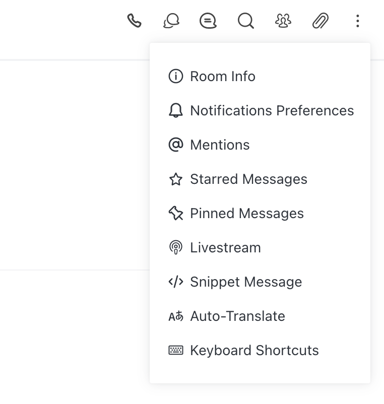

# Iconography

## Design principles

1. Simple — Our icons are geometric, recognizable on small screens, and have minimal form.
2. Literal — Whenever possible use symbols that represent the most basic representation of what it stands for.
3. Consistent — In style, detail, perspective, stroke weight, and the way it is used. Don't recreate established and standard icons.

## Creating icons

### Canvas Size

The icons are displayed most of time as 20x20px and 24x24px. However, by default, the icon must be drawn using the 32x32px grid.

### Grid and Keylines

Rocket.Chat icons are drawn on a pixel-based grid of 32px x 32px and scaled down to different sizes. Use the grid's keylines to shape the main structure.

### Stroke

They must be draw using 2px strokes on 32x32px canvas.

### Stroke Caps

They must be rounded.

### Corners

Corner radius must be 1px by default. Interior corners should be squared, not rounded.

### Perspective

1. Always keep the icon simple and face forward.
2. Icons should have no perspective nor have a large amount of detail. 

### Naming icon

We follow this naming pattern for icons: `Glyph / iconname-typename`.

* Glyph / audio
* Glyph / audio-disabled
* Glyph / send-filled

## Using icons

Only use icons from our [official released set](https://www.figma.com/file/gC0Y4IH5uthUymNW85If7EA2/Styleguide?node-id=110%3A41).

### Icons are commonly used in

* primary navigation
* page headers and section titles
* banners to bring attention to a specific theme \(such as a success or an error\)
* combination with text to add clarity

### Cross-platform adaptations

Icons like Share and Back has a different icon for Android and iOS. We follow their specific guidelines to make our product more familiar and easier to learn.

### Labeling Icon

Use meaningful icons instead of words where you could. Add a label to reduce the ambiguity of the icon's purpose when the context allows.

Use tooltips for unlabeled icons — include a text label or a short description of what the icon means. This reduces the effort of learning unfamiliar icons.


Consult a designer when you have a question, suggestion or you're requesting a new icon.


## Helpful articles

* [Optical Effects in User Interfaces](https://medium.muz.li/optical-effects-9fca82b4cd9a)
* [Material Design System Icons](https://material.io/design/iconography/system-icons.html#grid-and-keyline-shapes)
* [Apple System Icon Specs](https://developer.apple.com/design/human-interface-guidelines/ios/icons-and-images/system-icons/)

